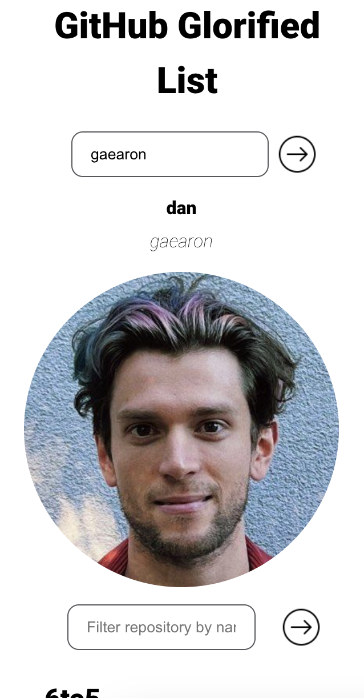
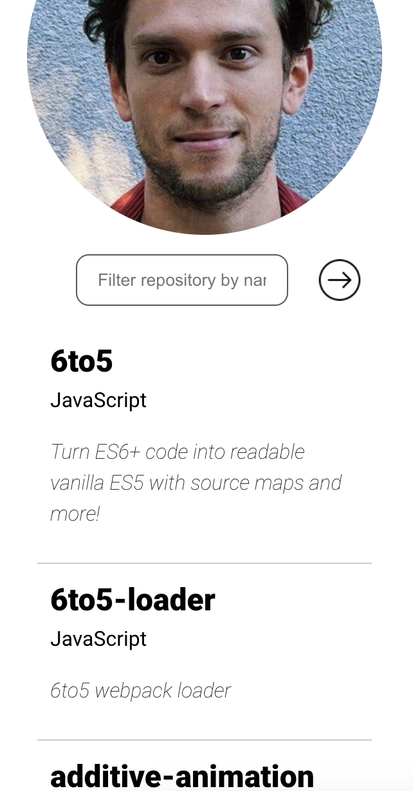

### GITHUB GLORIFIED LIST

Enter a GitHub username, explore their repositories, and effortlessly filter by name with GitHub Glorified List.

## Instructions

Here is how to run the project locally and run the tests suite.

1. Clone the repo
   ```sh
   git clone https://github.com/dvidaal/github-challenge-diana-vidal
   ```
2. Install NPM packages
   ```sh
   npm install
   ```
3. Run project locally
   ```sh
   npm run dev
   ```
4. Run the tests suite
   ```sh
   npm run test
   ```

## Future improvements

- Filter by language
- Add colors for the different stack languages
- Add pagination
- Add Toastify to give feedback for the user if it was not possible to find a user or repository...
- Add more information about the user (followers, following, bio)
- Add loader
- Design improvments for desktop version

## Deploy

Here you can play with the app 😁

https://mvst-github-challenge-diana-vidal.netlify.app/

## Sneak peek

<div style="display: flex; justify-content: space-between;">
  
  
</div>
